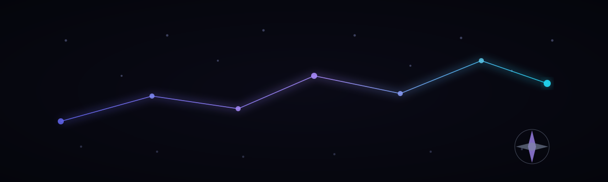

  

<h1 align="center">B R A I N N A V I G A T O R &nbsp;R2</h1>

<em>575 public handles on the route. 9,464 private nodes never touched.</em>

  
  
  
  
  
  

Separate 0.8B LoRA SKU. **Does not overwrite**
[`SZLHOLDINGS/SZL-Khipu-1.5B-BrainNavigator`](https://huggingface.co/SZLHOLDINGS/SZL-Khipu-1.5B-BrainNavigator)
or [`SZLHOLDINGS/SZL-Khipu-1.5B`](https://huggingface.co/SZLHOLDINGS/SZL-Khipu-1.5B).

| | |
|---|---|
| Base | `Qwen/Qwen3.5-0.8B` Apache-2.0 |
| Quant | **bf16 LoRA** r=16 α=32. QLoRA forbidden on Qwen3.5. |
| GPU | RTX 5050 Laptop 8GB **Blackwell** |
| Curriculum | synthetic NAVIGATE/ABSTAIN over **575 public handles** |
| Private graph | 9464 nodes admitted to gradients = **0** |
| publication_eligible | **false** until MEASURED generate |
| Λ | Conjecture 1 — never a theorem |

Train loss is not eval. Named-N generate lives in `eval_report.json`.

---

  Software retrieval hologram: <a href="https://huggingface.co/spaces/SZLHOLDINGS/second-brain">SZLHOLDINGS/second-brain</a> 
  Hub: <a href="https://huggingface.co/SZLHOLDINGS/brain-navigator-r2">SZLHOLDINGS/brain-navigator-r2</a>

