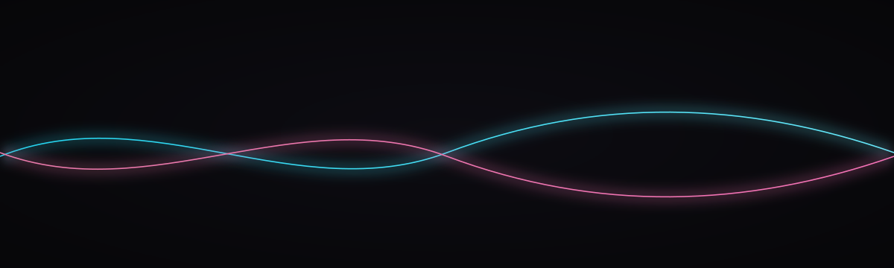

> **QUARANTINE.** Research residue. Strip owner-machine absolute paths.
> Not flagship. Not a production checkpoint.

<p align="center">
  
</p>

<h1 align="center">C H A S K I · 5 0 5 0</h1>

<p align="center"><em>Curriculum as identity. The filename is the experiment.</em></p>

<p align="center">
  
  
  
  
  
  <a href="https://huggingface.co/SZLHOLDINGS/chaski"></a>
</p>

<p align="center">
  <code>KANCHAY</code> · Doctrine v11 · Lean <code>749/14/163</code> · Λ = Conjecture 1 (advisory) · <a href="https://a-11-oy.com">a-11-oy.com</a>
</p>

Adapters are present in the target model repository. Evaluation state: none-this-run; no evaluation score is claimed by this card. This card-only release updates documentation and an exact-source binding; it does not modify model artifacts or provider settings.

Owner-GPU recut on an RTX 5050 Laptop (bf16 LoRA, not QLoRA). Original SZL cut of disclosed Apache [`Qwen/Qwen3.5-0.8B`](https://huggingface.co/Qwen/Qwen3.5-0.8B). Not a republish of Qwen tensors. Not an Unsloth-default card. CUTTING.

<!-- SZL-ATELIER-CUT:v1:START -->
## The cut

Mix-ratio is usually a blog footnote. We named the model after the mix. 50/50 is the cut.

Curriculum as identity. The filename is the experiment.

### Silhouette → leave → SZL

| Leader | Take, then tweak |
|---|---|
| Anthropic | Balanced helpful/harmless mix, as a named checkpoint. |
| NVIDIA | Recipe variant, published. |
| Unsloth | LoRA on Qwen3.5-0.8B, cutting tag. |

The differentiator is inspectability: the mix is named, the adapter digest is recorded, the evaluation gap stays visible, and the publication controller cannot promote the model.

## Intended use

Ablation sibling of chaski.

## Limitations

- proposal-only and research-only
- No signed held-out evaluation receipt for this 5050 adapter is present in this source tree.
- Publishing this card is a documentation update, not model promotion or autonomy approval.

Canonical GitHub: [`chaski/README_5050.md`](https://github.com/szl-holdings/szl-forge/blob/main/chaski/README_5050.md)
<!-- SZL-ATELIER-CUT:v1:END -->

## Specification

| | |
|---|---|
| **Artifact** | `adapter_model.safetensors` 25,587,104 bytes **AVAILABLE** (sha256 `620b3488fac2ebc6518090424de5b3c6a182293cf52dfd5bd9f886f54aef0df5`) |
| **Job** | `local-5050` (owner metal, **not** an HF Job) |
| **Does NOT overwrite** | [`SZLHOLDINGS/chaski`](https://huggingface.co/SZLHOLDINGS/chaski) |
| **Dataset** | [`SZLHOLDINGS/szl-1-doctrine-sft`](https://huggingface.co/datasets/SZLHOLDINGS/szl-1-doctrine-sft) · 41 rows · jsonl sha256 `ddc5594b…0611a243` |
| **Publication / autonomy** | false / false |
| **Card publication** | Card, banner, and source binding only; weights, adapter, configs, evals, visibility, hardware, collection, and runtime state unchanged |
| **License** | Apache-2.0 |

## Evaluation

**Status: none-this-run.** No JSON/refusal gate ran. Not 5/5. Not 6/6. Do not load this ID into the Khipu lab.

`train_loss` MEASURED `2.228136855544466` is a **train metric**, not an eval (method: Unsloth trainer log, N=41 rows, 3 epochs, 33 steps, `train_runtime` 883.2224s, 2026-08-28 17:56 UTC). File: `training_receipt.json`.

## Training (MEASURED this run)

- Recipe: `train_chaski_bf16_5050.py` · Unsloth 2026.7.2 · transformers 5.5.0 · torch 2.10.0+cu128
- GPU: NVIDIA GeForce RTX 5050 Laptop, 7.96 GB
- LoRA r=16 α=16, bf16, batch 1, ga 4, lr 2e-4, adamw_8bit, seed 11, max_seq 2048
- `copied_live_chaski_weights: false`

## What this is NOT

- Not live Chaski
- Not a Qwen rehost
- Not a GGUF of this adapter. Mini GGUFs are LIVE on [`A11OY-MINI`](https://huggingface.co/SZLHOLDINGS/A11OY-MINI) (evals none-this-run; they do not inherit this card)
- Not production. Lab load forbidden.

## Load

```python
from peft import PeftModel
from transformers import AutoModelForCausalLM, AutoTokenizer

base_id = "Qwen/Qwen3.5-0.8B"
tok = AutoTokenizer.from_pretrained(base_id)
base = AutoModelForCausalLM.from_pretrained(base_id)
model = PeftModel.from_pretrained(base, "SZLHOLDINGS/chaski-5050")
```

Doctrine v11 LOCKED. Λ = Conjecture 1 (advisory, never a theorem). Owner: Stephen Lutar / SZL Holdings.
