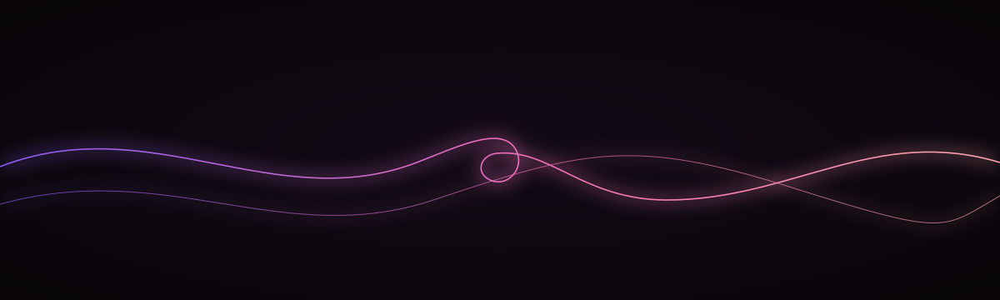

  

<h1 align="center">C H A S K I · R 2</h1>

<em>A lineage you can walk. R1 stays up. R2 is the next knot.</em>

  
  
  
  
  
  

Owner-GPU recut on NVIDIA GeForce RTX 5050 Laptop (8GB). Original SZL cut of
disclosed Apache `Qwen/Qwen3.5-0.8B`. **Not QLoRA.** Unsloth 2026-08 does not
recommend QLoRA on Qwen3.5 (dense or MoE) because of higher-than-normal
quantization differences.

This is a **separate SKU**. It does **not** overwrite live `SZLHOLDINGS/chaski`
and is **not** `SZLHOLDINGS/chaski-5050` (that kit is r=16 α=16 on doctrine
SFT). This SKU is r=16 α=32 on `chaski_r2/train.jsonl` only.

<!-- SZL-ATELIER-CUT:v1:START -->
## The cut

Round-2 is a first-class citizen in this estate. We do not overwrite R1. We add a sibling.

A lineage you can walk. R1 stays up. R2 is the next knot.

### Silhouette → leave → SZL

| Leader | Take, then tweak |
|---|---|
| Anthropic | Versioned constitutions. |
| NVIDIA | Recipe rerun. |
| Unsloth | Another FastLanguageModel job. |

This adapter remains a research proposal artifact; no qualification pass is claimed.

## Intended use

Lineage walk. Compare, do not silently replace.

## Limitations

- proposal-only

Canonical GitHub: [`chaski-r2/card/README.md`](https://github.com/szl-holdings/szl-forge/blob/main/chaski-r2/card/README.md)
<!-- SZL-ATELIER-CUT:v1:END -->

## Honest status

| | |
|---|---|
| **Base** | `Qwen/Qwen3.5-0.8B` |
| **Method** | Unsloth bf16 LoRA (`load_in_4bit=False`, `load_in_16bit=True`) |
| **LoRA** | r=16, α=32, seed 11, response-only CE |
| **Dataset** | `chaski_r2/train.jsonl` (32 rows). Named-N gates held out of gradients. |
| **Epochs / steps** | 3 epochs, batch 1, grad accum 2 |
| **Train loss** | MEASURED `0.7656` — train metric, **not an eval** |
| **Train runtime** | MEASURED on RTX 5050 Laptop 8GB |
| **Adapter sha256** | `440340ce29e19344c0625d0adfe820b277cdb0e24099d4e612f88ad6b3cf49c6` |
| **Evals** | none-this-run; train loss is not a JSON-draft/refusal evaluation |
| **publication_eligible** | false; published adapter bytes do not establish qualification |
| **Jobs** | local-5050 owner metal; HF Jobs not fired from the GitHub kit |
| **Ollama / llama-server** | `llama-server` is missing. No tok/s claimed. |

Train loss is not a JSON-draft or refusal gate. Not 5/5 or 6/6. Lab load
forbidden. House CPU lab stays signed Khipu GGUF.

### Framework versions

- PEFT 0.19.1
