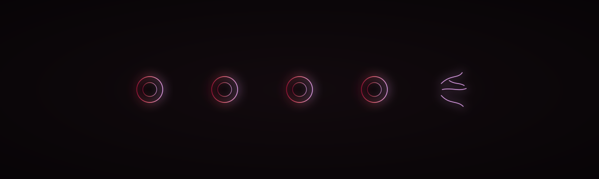

  

<h1 align="center">K H I P U &nbsp;R 3</h1>

<em>The knot that reports its own slipping — abstain 0/6, on the card.</em>

  
  
  
  
  
  

Laptop Blackwell Unsloth **bf16 LoRA** (r=16 α=32) of the forge `khipu/` curriculum
(`train.jsonl` + `train.abstain.jsonl`, 23 rows) on `Qwen/Qwen3.5-0.8B`.

| Claim | Status |
|---|---|
| Train loss 0.4397 | MEASURED (train metric, not eval) |
| Held-out generate | MEASURED grounding 4/5, abstain 0/6 (NAVIGATE instead of ABSTAIN) |
| publication_eligible | false |
| Overwrites 1.5B / KHIPU-R2 / brain-navigator-r2 | never |
| QLoRA | forbidden on Qwen3.5; this SKU is bf16 LoRA |
| Λ uniqueness | Conjecture 1, never a theorem |

---

  GitHub source: <a href="https://github.com/szl-holdings/szl-forge/tree/main/khipu">szl-holdings/szl-forge · khipu/</a> 
  Hub: <a href="https://huggingface.co/SZLHOLDINGS/khipu-r3">SZLHOLDINGS/khipu-r3</a>

