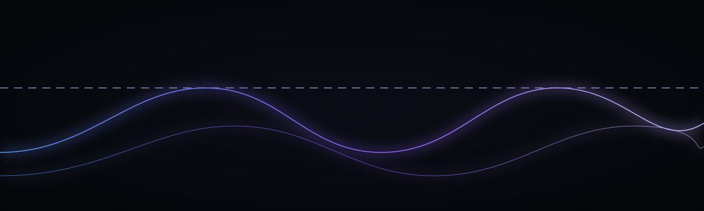

---
tags:
- kernel
- governance
- lambda
- gate
- provenance
- torch
- surrogate
- pytorch
- doi:10.5281/zenodo.19944926
library_name: kernels
license: apache-2.0
---

> ### CORRECTION 2026-08-30 — the surrogate weights are NOT in this repo
>
> A callout below stated that this repository "also ships" `model.safetensors`, `config.json` with MEASURED
> fidelity **0.9670**. They are not here — every one returns **HTTP 404** on
> `resolve/main`. `MODEL_PROVENANCE.json` also asserted `trained_weights_present: true`
> with a sha256 for the missing file; that attestation has been corrected in the same
> commit and now reads `false`, with the digest retained as the *expected* value for
> when the weights are pushed.
>
> What remains true: the kernel is real, `get_kernel` is import-LIVE, and
> `TRAINING_RECEIPT.json` documents a genuine training run, so the fidelity figures
> keep their provenance. What was false: the claim that the resulting artifact is
> downloadable from this repo. **Do not build against the surrogate here — there is
> nothing to load.** The kernel was always the declared ground truth; that part of the
> card was correct and is unchanged.

<!-- SZL-KERNEL-OPERATIONAL:START -->
## Operational (MEASURED laptop-Blackwell)

> **STATUS:** tests **FAIL**. `get_kernel` **import-LIVE**. Unsloth/LoRA is the wrong tool. Receipted kernels, not silent CUDA.

| Thing | Label | Method / N / date / what-NOT |
|---|---|---|
| tests (`PYTHONPATH=torch-ext`) | **FAIL** | MEASURED 2026-08-29T15:53:47Z host `betterwithage` Windows-10-10.0.26200-SP0. torch `2.10.0+cu128`. GPU `NVIDIA GeForce RTX 5050 Laptop GPU` arch `Blackwell`. pytest `4 failed, 54 passed, 14 warnings in 52.57s`. Failed nodes: `tests/test_lambda.py::test_torch_compile_friendly; tests/test_lambda.py::test_fullgraph_lambda_aggregate; tests/test_lambda.py::test_fullgraph_lambda_gate_score; tests/test_lambda.py::test_fullgraph_lambda_gate_batch_score`. What-NOT: not a leaderboard. torch.compile fullgraph failures on Windows Blackwell (`cl is not found`) are MEASURED, not hidden. |
| Kernel Hub `get_kernel` | **import-LIVE** | kernels `0.16.1`. Default: `get_kernel("SZLHOLDINGS/szl-lambda-gate", revision="main", trust_remote_code=True)` → `True`. `backend="cpu"` → `True`. trust_remote_code=False → `ValueError` (SZLHOLDINGS is not a trusted publisher). repo_type=kernel required (kernels 0.16). What-NOT: not a weight load; do not pickle/joblib.load. |
| formula-tax | **ADVISORY** | locked-8 `F1 F4 F7 F11 F12 F18 F19 F22`. registry_count=21. Λ geomean `0.316227766016838`. uniqueness **Conjecture 1** (never a theorem). |
| I1–I8 | **catalog** | `I1 receipt-chain-continuity; I2 ledger-failure-shape; I3 served-run-has-model; I4 signed-columns-atomic; I5 loop-steps-positive; I6 receipt-ed25519-verify; I7 receipt-columns-consistent; I8 flywheel-lineage`. Executed by `SZLHOLDINGS/szl-invariants`. Statuses never coerced. Λ untouched. |
| CUDA speedup / tokens/s / joules | **UNAVAILABLE** | Not claimed. Receipted kernels, not silent CUDA. |

GitHub source: [`szl-holdings/szl-lambda-gate`](https://github.com/szl-holdings/szl-lambda-gate) @ `3fb5bb65dfdba006ae917e10b7703a535ea303e0`. Artifacts: [`BENCH.laptop-blackwell.json`](./BENCH.laptop-blackwell.json), [`OPERATIONAL.json`](./OPERATIONAL.json).

```python
from kernels import get_kernel
k = get_kernel("SZLHOLDINGS/szl-lambda-gate", revision="main", trust_remote_code=True)
```

<!-- SZL-KERNEL-OPERATIONAL:END -->


<!-- SZL-ESTATE-CARD:v2:START -->
<p align="center"><a href="https://a-11-oy.com/"></a></p>
<p align="center">
  <a href="https://github.com/szl-holdings/.github/tree/main/doctrine"></a>
  <a href="https://a-11-oy.com/"></a>
  <a href="https://huggingface.co/datasets/SZLHOLDINGS/szl-lake"></a>
  <a href="https://huggingface.co/spaces/SZLHOLDINGS/holographic"></a>
</p>
<p align="center"><sub>Part of the <a href="https://huggingface.co/SZLHOLDINGS">SZL Holdings</a> governed estate — claims are designed to carry checkable receipts. Verification proves integrity &amp; origin, never accuracy or performance.</sub></p>
<!-- SZL-ESTATE-CARD:v2:END -->

<!-- SZL-ARTIFACT-NOTICE:v1:START — honesty plate: repo semantics, no fake model tags. -->
> **🟥 Kernel real; surrogate weights NOT PUBLISHED — see the correction at the top.** The Λ governance kernel (pure-torch, differentiable) is UNCHANGED and remains the sole ground truth. Since **surrogate v1** this repo was described as shipping (IT DOES NOT — 404) `model.safetensors` + `config.json` — a real trained tiny torch MLP that predicts the ADVISORY gate decision `lambda_gate(axes, threshold).passed` over the 13-axis Yuyay space, with **MEASURED** fidelity **0.9670** (agreement vs the kernel on a held-out split). The surrogate approximates the gate DECISION only; the kernel Λ stays authoritative and `get_kernel`-discoverable. **Λ is the weighted geometric mean, NOT proven trust — uniqueness = Conjecture 1 (OPEN).**
<!-- SZL-ARTIFACT-NOTICE:v1:END -->

<p align="center">
  
</p>

<h1 align="center">L A M B D A · G A T E</h1>

<p align="center"><em>The smallest possible governed op. Fail-closed by default.</em></p>

<p align="center">
  <a href="https://huggingface.co/SZLHOLDINGS/szl-lambda-gate/tree/main/build/torch-universal/szl_lambda_gate"></a>
  
  
  
  <a href="https://huggingface.co/SZLHOLDINGS/szl-lambda-gate/blob/main/MODEL_PROVENANCE.json"></a>
  <a href="https://doi.org/10.5281/zenodo.19944926"></a>
  <a href="https://huggingface.co/SZLHOLDINGS/szl-lambda-gate/blob/main/LICENSE"></a>
</p>

> **Kernel Hub migration (verified 2026-07-15):** `get_kernel(...)` now resolves
> the matching first-class [Kernel Hub repository](https://huggingface.co/kernels/SZLHOLDINGS/szl-lambda-gate).
> Its `main` and stable `v1` refs both pin verified revision
> `47c7eb2db8859507d4115adbbff20c65de66dbb5`. This model-type repository is
> retained as the legacy source/card mirror.

**Λ — a governance aggregator as a Hugging Face kernel.** A differentiable, torch.compile-friendly weighted-geometric-mean aggregator with an ADVISORY non-compensatory gate and runtime axiom self-checks, from [SZL Holdings](https://huggingface.co/SZLHOLDINGS).

> Companion to [`szl-governed-norm`](https://huggingface.co/SZLHOLDINGS/szl-governed-norm). Where that kernel makes a normalization *auditable*, this one makes a *governance decision* computable and checkable at the tensor layer.

<!-- SZL-ATELIER-CUT:v1:START -->
## The cut

A gate you can `import` in PyTorch. Fail-closed by default.

The smallest possible governed op.

### Silhouette → leave → SZL

| Leader | Take, then tweak |
|---|---|
| Anthropic | Refuse compiled to autograd. |
| NVIDIA | Custom op, NVIDIA-shaped packaging. |
| Unsloth | No. |

Nobody else ships this combination. That is the point of a one-of-one.

## Intended use

Torch forward-pass gate.

## Limitations

- Surrogate. Not Conjecture-1 solved.

Canonical GitHub: [`szl-holdings/szl-khipu`](https://github.com/szl-holdings/szl-khipu/blob/main/szl_khipu/lambda_gate.py)
<!-- SZL-ATELIER-CUT:v1:END -->

## Interactive demo

> **Live demos (in-browser, nothing to install)** — [`lambda-gate-holo`](https://szlholdings-lambda-gate-holo.static.hf.space) (this kernel's holographic gate demo) · [`szl-kernels-live`](https://szlholdings-szl-kernels-live.static.hf.space) (unified suite demo).
>
> The quickstart above runs fully locally. For a full governed-kernel suite demo, see [szl-kernels](https://huggingface.co/SZLHOLDINGS/szl-kernels). For the live a11oy substrate, see [a11oy Space](https://huggingface.co/spaces/SZLHOLDINGS/a11oy).

## What Λ is — and is NOT (read this first)

Λ is the **weighted geometric mean** over axis scores in [0,1]:

\[ \Lambda(x) = \prod_i x_i^{w_i}, \quad \sum_i w_i = 1, \; w_i > 0, \; x_i \in [0,1] \]

It is a **non-compensatory, ADVISORY** roll-up: any single zeroed (or non-finite) axis drives the whole aggregate to 0 — a conservative "one bad axis fails the gate" signal. **Λ is NOT "proven trust" and NOT a closed theorem.** Its *uniqueness* (that the weighted geometric mean is the only aggregator satisfying the carried axioms) remains **Conjecture 1 — OPEN**. A gate "pass" is an advisory signal, never a guarantee. We label this honestly everywhere.

## Quickstart

```bash
pip install kernels torch
```

```python
import torch
from kernels import get_kernel

# Current `kernels` (>=0.15) requires an explicit revision/version + trust flag for org kernels:
lg = get_kernel("SZLHOLDINGS/szl-lambda-gate", revision="main", trust_remote_code=True)
# (once a tag is published you can pin it, e.g. revision="v0.2.0")

axes = torch.tensor([0.9, 0.8, 0.95])      # axis scores in [0,1]
score = lg.lambda_aggregate(axes)          # Λ(x) ∈ [0,1]
res   = lg.lambda_gate(axes, threshold=0.5)
print(res.score, res.passed, res.advisory) # advisory is always True

print(lg.selfcheck())                      # empirical A1–A4 checks + version
```

## API

| Function | Notes |
|---|---|
| `lambda_aggregate(axes, weights=None)` | Λ over the last dim. Differentiable, batched, torch.compile-friendly. |
| `lambda_gate(axes, weights=None, threshold=0.5)` | Advisory gate → `LambdaGateResult(score, passed, threshold, advisory)`. |
| `lambda_gate_batch(candidates, weights=None, threshold=0.5)` | Score many candidate vectors `(..., N, k)` in one call; returns the advisory pass mask. |
| `selfcheck()` | Empirical A1–A4 axiom checks + adversarial falsification search + version. NOT a uniqueness proof. |
| `is_monotone / is_homogeneous / is_egyptian_exact / is_bounded_by_max` | The four carried axioms as real runtime checks. |
| `yuyay_weights()`, `YUYAY_AXES`, `YUYAY_FLOORS` | Canonical 13-axis Yuyay preset (advisory). |
| layers: `LambdaGate`, `LambdaAggregate` | Pure `nn.Module` for the Kernel Hub layer-mapping mechanism. |

## Carried axioms (verifiable, not a proof)

- **A1 IsMonotone** — Λ is non-decreasing in each axis.
- **A2 IsHomogeneous (deg 1)** — Λ(t·x) = t·Λ(x).
- **A3 IsEgyptianExact** — Λ(c,…,c) = c.
- **A4 IsBounded** — Λ(x) ≤ maxᵢ xᵢ.

`selfcheck()` verifies these empirically on sampled inputs and runs a random falsification search. A clean run is **evidence, not proof** — Λ-uniqueness is Conjecture 1 (open).

## Provenance

Backed by the Lean 4 formalization [szl-holdings/lutar-lean](https://github.com/szl-holdings/lutar-lean) (749 declarations / 14 axioms / 163 tracked sorries), DOI [10.5281/zenodo.20434308](https://doi.org/10.5281/zenodo.20434308). Λ uniqueness = Conjecture 1 (open).

## Honesty

- Pure-Python universal kernel — a correctness reference, not a CUDA speed record. No fabricated benchmarks (50 passing tests).
- Λ is advisory; never "proven trust."
- Prior art honestly attributed: the weighted geometric mean as a less-compensatory composite indicator is established practice (UN HDI 2010, OECD Composite Indicators Handbook 2008); the veto/cut-off idea is ELECTRE. The 13-axis conjunctive form is SZL's own yuyay_v3 gate.

## Compatibility

Python 3.9+, `torch>=2.5`, standard library + torch only.

## License

Apache-2.0. Copyright 2026 SZL Holdings.

## Trained Λ-gate surrogate v1 (MEASURED — see `TRAINING_RECEIPT.json`)

A real **tiny torch MLP** (3 hidden ReLU layers, 64 units; `model.safetensors` + `config.json`)
trained on **40,000 axis-score vectors** synthesized and **labeled by this kernel itself**
(`lambda_gate(axes, weights=yuyay_uniform_1/13, threshold=0.5).passed`, seed 20260721; 800
samples re-audited by independent full kernel replay during generation — all agreed). Inputs are
the 13 Yuyay axis scores in [0,1], including non-compensatory zero-route rows (a single zeroed
axis must fail the gate).

| metric | value |
|---|---|
| fidelity vs kernel (held-out agreement) | **0.9670** |
| recall GATE_PASS | 0.9912 |
| recall GATE_FAIL | 0.9469 |

**Honest boundary:** the surrogate learns the *decision boundary* of an ADVISORY, non-compensatory
aggregator; it is a fast approximation, NOT the exact Λ and NOT proven trust. Residual disagreement
lives near the Λ=threshold surface — the exact kernel `lambda_gate` remains authoritative. Class
counts: GATE_FAIL=21828, GATE_PASS=18172. Λ uniqueness = Conjecture 1 (open).

```python
import torch, json
from safetensors.torch import load_file
from torch import nn
cfg = json.load(open("config.json"))          # architecture + input_axes spec
class GateMLP(nn.Module):
    def __init__(self, k, h):
        super().__init__()
        self.net = nn.Sequential(nn.Linear(k,h), nn.ReLU(), nn.Linear(h,h), nn.ReLU(),
                                 nn.Linear(h,h), nn.ReLU(), nn.Linear(h,1))
    def forward(self, x): return self.net(x).squeeze(-1)
model = GateMLP(cfg["input_dim"], cfg["hidden"])
model.load_state_dict(load_file("model.safetensors")); model.eval()
axes = torch.rand(1, 13)
pred_pass = (torch.sigmoid(model(axes)) >= 0.5).item()   # advisory gate decision (surrogate)
```

Re-verify everything: `python scripts/eval.py` (sha256-checks the shipped `model.safetensors`
against the receipt, regenerates the seeded kernel-labeled dataset, retrains, and compares
fidelity within ±0.02).

---

## SZL Kernels Suite

Part of the [`szl-kernels`](https://huggingface.co/SZLHOLDINGS/szl-kernels) governed-kernel suite — the hub links every member, and each member links back to the hub so no leaf is orphaned:

| Kernel | Lane |
|---|---|
| [`szl-kernels`](https://huggingface.co/SZLHOLDINGS/szl-kernels) | **hub** — unified suite, cross-kernel `UnifiedReceiptChain` |
| [`szl-governed-norm`](https://huggingface.co/SZLHOLDINGS/szl-governed-norm) | RMSNorm/LayerNorm + SHA3-256 receipts |
| **`szl-lambda-gate`** (this repo) | **advisory Λ gate (Conjecture 1, OPEN)** |
| [`governed-inference-meter`](https://huggingface.co/SZLHOLDINGS/governed-inference-meter) | MEASURED-joule energy accounting (NVML) |
| [`szl-govsign`](https://huggingface.co/SZLHOLDINGS/szl-govsign) | signed governance attestation (DSSE / in-toto) |
| [`szl-blocked`](https://huggingface.co/SZLHOLDINGS/szl-blocked) | honest-BLOCKED state + EU AI Act Annex IV DRAFT |
| [`szl-provctl`](https://huggingface.co/SZLHOLDINGS/szl-provctl) | provenance-DAG verify + in-toto/SLSA interop |

**Live Spaces:** [a11oy](https://huggingface.co/spaces/SZLHOLDINGS/a11oy) · [hatun-mcp](https://huggingface.co/spaces/SZLHOLDINGS/hatun-mcp).

**Related — Governed Kernels collection:** [Governed Kernels & Verifiers](https://huggingface.co/collections/SZLHOLDINGS/governed-kernels-and-verifiers-6a542ad83a4b75151bf5eae3) groups the whole family in one page. **Live console:** [a11oy](https://szlholdings-a11oy.hf.space) · [a-11-oy.com](https://a-11-oy.com) · [llm-router](https://szlholdings-llm-router-live.hf.space) · [receipt verifier](https://szlholdings-governed-receipt-verifier.static.hf.space) · [receipt spec (hub)](https://github.com/szl-holdings/governed-receipt-spec).

---

<sub><b>SZL Holdings</b> · Λ governance aggregator · advisory, not proven trust · <a href="https://a-11-oy.com">a-11-oy.com</a> · <a href="https://github.com/szl-holdings">github.com/szl-holdings</a> · <a href="https://huggingface.co/SZLHOLDINGS">huggingface.co/SZLHOLDINGS</a></sub>

---

[](https://doi.org/10.5281/zenodo.19944926)

## Citation

**Cite this.** Part of the SZL Holdings *Ouroboros Thesis* (Governed Post-Determinism).  
Concept DOI (always-latest): [10.5281/zenodo.19944926](https://doi.org/10.5281/zenodo.19944926).  
Author: Stephen P. Lutar Jr. · [ORCID 0009-0001-0110-4173](https://orcid.org/0009-0001-0110-4173) · License CC-BY-4.0.  
Full DOI-pinned lineage (v1→v26) + the 8 papers: [szl-papers PAPERS_INDEX](https://github.com/szl-holdings/szl-papers/blob/main/PAPERS_INDEX.md).  
No artifact-specific DOI is minted for this model; the concept DOI above covers the program.

Honesty (Doctrine v11): Λ unconditional uniqueness is **Conjecture 1** (machine-checked FALSE as stated) — never a theorem; conditional uniqueness is **Theorem U** (axiom-free). Locked-proven formulas = **exactly 8** {F1,F4,F7,F11,F12,F18,F19,F22}; ~185 experimental theorems are a separate CI-green tier; Khipu BFT safety = Conjecture 2. Trust never 100%.

```bibtex
@misc{lutar_szl_ouroboros,
  author    = {Lutar, Stephen P., Jr.},
  title     = {SZL Holdings --- The Ouroboros Thesis (Governed Post-Determinism)},
  year      = {2026},
  publisher = {Zenodo},
  doi       = {10.5281/zenodo.19944926},
  url       = {https://doi.org/10.5281/zenodo.19944926},
  note      = {Concept DOI --- always resolves to the latest version. ORCID 0009-0001-0110-4173. CC-BY-4.0.}
}
```

*Signed-off-by: Stephen Lutar <stephenlutar2@gmail.com>*

## Files in this repo

| Path | What it is |
|---|---|
| `build/torch-universal/szl_lambda_gate/__init__.py` | public API — `lambda_aggregate`, `lambda_gate`, `selfcheck()` |
| `build/torch-universal/szl_lambda_gate/_lambda.py` | the weighted-geometric-mean aggregator + A1–A4 empirical checks |
| `build/torch-universal/szl_lambda_gate/layers.py` | `nn.Module` wrapper |
| `build.toml` · `metadata.json` | Kernel Hub build/metadata manifests |
| `LICENSE` · `SECURITY.md` | Apache-2.0 · security policy |

---

<p align="center">
  <a href="https://huggingface.co/SZLHOLDINGS">SZL Holdings</a> ·
  <a href="https://a-11-oy.com">a-11-oy.com</a> ·
  <a href="https://huggingface.co/SZLHOLDINGS/szl-kernels">szl-kernels</a>
</p>

<p align="center"><sub>SLSA: L1 honest · L2 attested · L3 roadmap. Λ = Conjecture 1 (advisory, never a theorem). Trust ceiling 0.97 — never 100%. Labels honest by default: MEASURED / REPORTED / MODELED / HEURISTIC / UNKNOWN / UNAVAILABLE. locked-proven = exactly 8 {F1,F4,F7,F11,F12,F18,F19,F22}.</sub></p>
