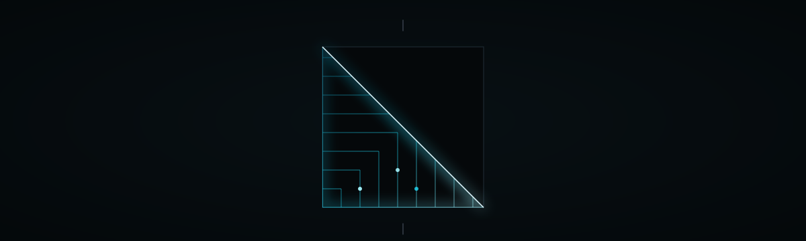

<!-- SZL-KERNEL-OPERATIONAL:START -->
## Operational (MEASURED laptop-Blackwell)

> **STATUS:** tests **PASS**. `get_kernel` **import-LIVE**. Unsloth/LoRA is the wrong tool. Receipted kernels, not silent CUDA.

| Thing | Label | Method / N / date / what-NOT |
|---|---|---|
| tests (`PYTHONPATH=torch-ext`) | **PASS** | MEASURED 2026-08-29T15:54:20Z host `betterwithage` Windows-10-10.0.26200-SP0. torch `2.10.0+cu128`. GPU `NVIDIA GeForce RTX 5050 Laptop GPU` arch `Blackwell`. pytest `12 passed in 3.80s (after torch-universal refresh)`. Failed nodes: `none`. What-NOT: not a leaderboard. torch.compile fullgraph failures on Windows Blackwell (`cl is not found`) are MEASURED, not hidden. |
| Kernel Hub `get_kernel` | **import-LIVE** | kernels `0.16.1`. Default: `get_kernel("SZLHOLDINGS/szl-maskmod", revision="main", trust_remote_code=True)` → `True`. `backend="cpu"` → `True`. trust_remote_code=False → `ValueError` (SZLHOLDINGS is not a trusted publisher). repo_type=kernel required (kernels 0.16). What-NOT: not a weight load; do not pickle/joblib.load. |
| formula-tax | **ADVISORY** | locked-8 `F1 F4 F7 F11 F12 F18 F19 F22`. registry_count=21. Λ geomean `0.316227766016838`. uniqueness **Conjecture 1** (never a theorem). |
| I1–I8 | **catalog** | `I1 receipt-chain-continuity; I2 ledger-failure-shape; I3 served-run-has-model; I4 signed-columns-atomic; I5 loop-steps-positive; I6 receipt-ed25519-verify; I7 receipt-columns-consistent; I8 flywheel-lineage`. Executed by `SZLHOLDINGS/szl-invariants`. Statuses never coerced. Λ untouched. |
| CUDA speedup / tokens/s / joules | **UNAVAILABLE** | Not claimed. Receipted kernels, not silent CUDA. |

GitHub source: [`szl-holdings/szl-maskmod`](https://github.com/szl-holdings/szl-maskmod) @ `7e9d9e3af892d76fc1c34d280b8f516ac57c3a17`. Artifacts: [`BENCH.laptop-blackwell.json`](./BENCH.laptop-blackwell.json), [`OPERATIONAL.json`](./OPERATIONAL.json).

```python
from kernels import get_kernel
k = get_kernel("SZLHOLDINGS/szl-maskmod", revision="main", trust_remote_code=True)
```

<!-- SZL-KERNEL-OPERATIONAL:END -->

<p align="center">
  
</p>

<h1 align="center">S Z L &nbsp;M A S K M O D</h1>

<p align="center"><em>Every safety paper multiplies by 0.1. We multiply by 0.</em></p>

<p align="center">
  
  
  
  
  
  
</p>

`KANCHAY` · Doctrine v11 · Lean `749/14/163` · Λ = Conjecture 1 (advisory) · [a-11-oy.com](https://a-11-oy.com)

Kernel sources are on this repo. CPU `get_kernel` import-LIVE is MEASURED. GPU **UNAVAILABLE** (no cubin + timed run). Not a model. Not listed next to Chaski or Qantu.

<!-- SZL-KERNEL-STATUS:import-LIVE:START -->
## Status


<!-- SZL-ATELIER-CUT:v1:START -->
## The cut

Every safety paper multiplies by 0.1. We multiply by 0. There is no 'a little bit unauthorized'.

Hard masks as the default, not an ablation.

### Silhouette → leave → SZL

| Leader | Take, then tweak |
|---|---|
| Anthropic | Hard refuse, compiled. |
| NVIDIA | Fused mask kernel. |
| Unsloth | No. |

Nobody else ships this combination. That is the point of a one-of-one.

## Intended use

Compose with receipt-attn.

## Limitations

- Kernel.

Canonical GitHub: [`szl-holdings/szl-khipu`](https://github.com/szl-holdings/szl-khipu/blob/main/szl_khipu/maskmod.py)
<!-- SZL-ATELIER-CUT:v1:END -->


> **STATUS: import-LIVE** on CPU Kernel Hub `get_kernel` (kernels `0.16.1`). GPU attention / Flash / Sage / Flex / Triton is **UNAVAILABLE**.

| Thing | Label | Method / N / date / what-NOT |
|---|---|---|
| Kernel Hub `get_kernel` | **import-LIVE** | MEASURED 2026-08-28 2:28pm ET on kernels `0.16.1`. HEAD [`1e2ebef`](https://huggingface.co/kernels/SZLHOLDINGS/szl-maskmod/commit/1e2ebef3c3faec7bb9ca178e708eb5d7af8ffe69) (`1e2ebef3c3faec7bb9ca178e708eb5d7af8ffe69`). Legal name `szl-maskmod` (Python module `szl_maskmod`). Variants: `build/torch-universal` (default `get_kernel`) and `build/torch-cpu` (`backend="cpu"`). Working calls: `get_kernel("SZLHOLDINGS/szl-maskmod", revision="main", trust_remote_code=True)` and the same with `backend="cpu"`. `selfcheck` ok=true, chain_ok=true, chain_depth=1, max_abs_vs_sdpa_causal=2.384185791015625e-07. What-NOT: no tokens/s; no joules. CPU torch Flex-silhouette (score_mod + block-mask). GPU/Triton not claimed LIVE. Λ = Conjecture 1 (advisory). |
| GPU attention (Flash / Sage / Flex / Triton) | **UNAVAILABLE** | Not claimed LIVE. This stamp is CPU torch Flex-silhouette only. |

<!-- SZL-KERNEL-STATUS:import-LIVE:END -->

Canonical source: https://github.com/szl-holdings/szl-maskmod

This Hub repo is the publish mirror. ATELIER owns cards. No CUDA benches. Λ = Conjecture 1. Apache-2.0.

```python
from szl_maskmod import maskmod_attn, ReceiptChain, selfcheck
import torch
q = k = v = torch.randn(1, 2, 8, 16)
y = maskmod_attn(q, k, v, causal=True)
print(selfcheck())
```

---

<p align="center">
  Hub: <a href="https://huggingface.co/SZLHOLDINGS/szl-maskmod">SZLHOLDINGS/szl-maskmod</a>
</p>
