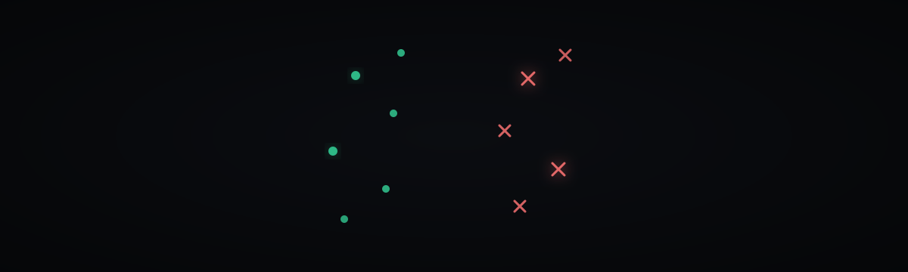

> **NOT A LOADABLE MODEL.** This repository contains no weight artifact — no
> `joblib`, no `npz`, no `safetensors`. It previously declared
> `library_name: sklearn` with `sklearn` and `joblib` tags, which told the Hub to
> present it as a loadable scikit-learn model; nothing here can be loaded that
> way. `get_kernel` is **UNAVAILABLE** (returns `False`), so the kernel path does
> not resolve either. Both the sklearn declaration and the kernel path have been
> removed from the metadata rather than left to imply a capability that is
> absent. The surrogate rules and tests in this repo are real; the checkpoint is
> not.

  

<h1 align="center">S Z L &nbsp;N E M O</h1>

<em>Honesty over SEO: scripts and a receipt, no checkpoint. Do not invent the blob.</em>

  
  
  
  
  
  

**STATUS: SOFTWARE · NOT TRAINED as an LLM · no Nemotron/Unsloth weights · joblib UNAVAILABLE.**

Canonical GitHub source: [`szl-holdings/szl-nemo`](https://github.com/szl-holdings/szl-nemo).
Hub ID `SZLHOLDINGS/szl-nemo` is a **sklearn recipe-conformance surrogate card**.
It is **not** NVIDIA Nemotron. It is **not** a generative model. It is **not**
a Triton/CUDA kernel. Tags `nemotron` and `ollama` were misleading and are **stripped**.
Do not `from_pretrained` this as an LLM. SZL has **not** fine-tuned Nemotron and does **not** republish NVIDIA weights.

Approved GitHub path: `szl_nemo.rule_check` (stdlib, R1–R5). `model.joblib` is quarantined.

## What it is / is NOT

- **IS:** `scripts/forge.py` + `scripts/eval.py` + `TRAINING_RECEIPT.json` describing a `Pipeline(TfidfVectorizer → LogisticRegression)` that triages whether a *text answer* conforms to five doctrine rules (R1–R5). Deterministic `rule_check()` in `scripts/forge.py` remains ground truth. Optional `Modelfile` is prompt text only.

<!-- SZL-ATELIER-CUT:v1:START -->
## The cut

We took the idea of recipe-conformance from NVIDIA NeMo and built a tiny sklearn surrogate that triages answers against five doctrine rules. Then we stripped the misleading nemotron tags. Honesty over SEO.

A 10-millisecond 'does this answer violate doctrine?' that CI can run on every card.

### Silhouette → leave → SZL

| Leader | Take, then tweak |
|---|---|
| Anthropic | Constitutional classifier, tiny. |
| NVIDIA | Silhouette of NeMo recipe-conformance. Cut: sklearn, disclosed, not a Nemotron. |
| Unsloth | No. |

Nobody else ships this combination. That is the point of a one-of-one.

## Intended use

CI doctrine triage. Retrain from forge.py.

## Limitations

- model.joblib not on Hub at snapshot.
- Not Nemotron. Not generative.

Canonical GitHub: [`szl-holdings/szl-nemo`](https://github.com/szl-holdings/szl-nemo/blob/main/README.md)
<!-- SZL-ATELIER-CUT:v1:END -->

- **NOT:** NVIDIA Nemotron 3 Nano 4B. Not ollama-ready Nemotron weights. Not a chatbot. Not a fine-tune. `BASE_MODEL_MANIFEST.json` is an observation of an upstream Ollama tag (mutable); it is **not** weights in this repo.

## Status

| Thing | Label | Method / N / date / what-NOT |
|---|---|---|
| `model.joblib` on Hub | **UNAVAILABLE** | Hub file list 2026-08-28 ~6:56pm ET. Files on main: `.gitattributes`, `BASE_MODEL_MANIFEST.json`, `LICENSE`, `Modelfile`, `README.md`, `SZL_ESTATE_MANAGED.json`, `TRAINING_RECEIPT.json`, `scripts/eval.py`, `scripts/forge.py`. **No `model.joblib`.** Receipt names file `model.joblib` sha256 `d3f0cd7bebbb73fedbc9a0f098148f46f5834bf9184b43cd29b07f286a77ff5b` — that blob is **not published here**. Do not invent it. |
| Receipt-bound scorer metrics | **REPORTED in `TRAINING_RECEIPT.json`** | `trained_at_utc` 2026-07-21T02:52:42Z, host replit 2-vCPU, sklearn 1.9.0, seed 20260721. N=5620 checker-labelled rows (2638 conform / 2982 violation), 80/20 stratified. `fidelity_vs_rule_checker` **1.0**; unseen paraphrases **0.8333** (N=**12**). What-NOT: not LLM quality; not a Nemotron benchmark; **cannot be replayed from Hub bytes until `model.joblib` is present**. |
| Nemotron / generative evals | **UNAVAILABLE** | None on this card. Quality of any Nemotron run on SZL hardware: **UNAVAILABLE**. |
| NVIDIA weights | **NOT REPUBLISHED** | Never copy upstream tensors into this ID. |

When `model.joblib` is actually committed, load with `joblib.load("model.joblib")` and sha256-check against the receipt. Until then, this ID is scripts + a receipt, not a loadable sklearn artifact.

Apache-2.0 for SZL files here. Upstream Nemotron, if you fetch it yourself, stays under NVIDIA's license. Λ = Conjecture 1.

---

  Hub: <a href="https://huggingface.co/SZLHOLDINGS/szl-nemo">SZLHOLDINGS/szl-nemo</a>

