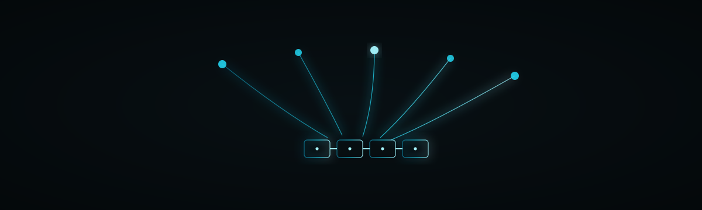

<!-- SZL-KERNEL-OPERATIONAL:START -->
## Operational (MEASURED laptop-Blackwell)

> **STATUS:** tests **PASS**. `get_kernel` **import-LIVE**. Unsloth/LoRA is the wrong tool. Receipted kernels, not silent CUDA.

| Thing | Label | Method / N / date / what-NOT |
|---|---|---|
| tests (`PYTHONPATH=torch-ext`) | **PASS** | MEASURED 2026-08-29T15:54:14Z host `betterwithage` Windows-10-10.0.26200-SP0. torch `2.10.0+cu128`. GPU `NVIDIA GeForce RTX 5050 Laptop GPU` arch `Blackwell`. pytest `15 passed, 1 skipped in 2.66s`. Failed nodes: `none`. What-NOT: not a leaderboard. torch.compile fullgraph failures on Windows Blackwell (`cl is not found`) are MEASURED, not hidden. |
| Kernel Hub `get_kernel` | **import-LIVE** | kernels `0.16.1`. Default: `get_kernel("SZLHOLDINGS/szl-receipt-attn", revision="main", trust_remote_code=True)` → `True`. `backend="cpu"` → `True`. trust_remote_code=False → `ValueError` (SZLHOLDINGS is not a trusted publisher). repo_type=kernel required (kernels 0.16). What-NOT: not a weight load; do not pickle/joblib.load. |
| formula-tax | **ADVISORY** | locked-8 `F1 F4 F7 F11 F12 F18 F19 F22`. registry_count=21. Λ geomean `1.0`. uniqueness **Conjecture 1** (never a theorem). |
| I1–I8 | **catalog** | `I1 receipt-chain-continuity; I2 ledger-failure-shape; I3 served-run-has-model; I4 signed-columns-atomic; I5 loop-steps-positive; I6 receipt-ed25519-verify; I7 receipt-columns-consistent; I8 flywheel-lineage`. Executed by `SZLHOLDINGS/szl-invariants`. Statuses never coerced. Λ untouched. |
| CUDA speedup / tokens/s / joules | **UNAVAILABLE** | Not claimed. Receipted kernels, not silent CUDA. |

GitHub source: [`szl-holdings/szl-receipt-attn`](https://github.com/szl-holdings/szl-receipt-attn) @ `1aa6cf77de5a789125c7961c6c9f1642ed7bd062`. Artifacts: [`BENCH.laptop-blackwell.json`](./BENCH.laptop-blackwell.json), [`OPERATIONAL.json`](./OPERATIONAL.json).

```python
from kernels import get_kernel
k = get_kernel("SZLHOLDINGS/szl-receipt-attn", revision="main", trust_remote_code=True)
```

<!-- SZL-KERNEL-OPERATIONAL:END -->

<p align="center">
  
</p>

<h1 align="center">S Z L &nbsp;R E C E I P T &nbsp;A T T N</h1>

<p align="center"><em>A model that cannot attend to what it is not allowed to see.</em></p>

<p align="center">
  
  
  
  
  
  
</p>

`KANCHAY` · Doctrine v11 · Lean `749/14/163` · Λ = Conjecture 1 (advisory) · [a-11-oy.com](https://a-11-oy.com)

Kernel sources are on this repo. CPU `get_kernel` import-LIVE is MEASURED. GPU **UNAVAILABLE** (no cubin + timed run). Not a model. Not listed next to Chaski or Qantu.

<!-- SZL-KERNEL-STATUS:import-LIVE:START -->
## Status


<!-- SZL-ATELIER-CUT:v1:START -->
## The cut

Guardrails after generation are late. Masking before softmax is the thing nobody ships because it hurts scores. We want the hurt.

A model that cannot attend to what it is not allowed to see.

### Silhouette → leave → SZL

| Leader | Take, then tweak |
|---|---|
| Anthropic | Constitution applied at the attention head. |
| NVIDIA | Fused kernel, NVIDIA-shaped, SZL-cut. |
| Unsloth | No. |

Nobody else ships this combination. That is the point of a one-of-one.

## Intended use

Fuse into governed decode.

## Limitations

- Kernel, not weights.

Canonical GitHub: [`szl-holdings/szl-khipu`](https://github.com/szl-holdings/szl-khipu/blob/main/szl_khipu/receipt_attn.py)
<!-- SZL-ATELIER-CUT:v1:END -->


> **STATUS: import-LIVE** on CPU Kernel Hub `get_kernel` (kernels `0.16.1`). GPU **UNAVAILABLE**.

| Thing | Label | Method / N / date / what-NOT |
|---|---|---|
| Kernel Hub `get_kernel` | **import-LIVE** | MEASURED 2026-08-28 2:29pm ET on kernels `0.16.1`. HEAD [`42d9a31`](https://huggingface.co/kernels/SZLHOLDINGS/szl-receipt-attn/commit/42d9a31c5ca1749fca16017d73880cbc4c5050fc) (`42d9a31c5ca1749fca16017d73880cbc4c5050fc`). Legal name `szl-receipt-attn` (Python module `szl_receipt_attn`). Variants: `build/torch-universal` (default `get_kernel`) and `build/torch-cpu` (`backend="cpu"`). Working calls: `get_kernel("SZLHOLDINGS/szl-receipt-attn", revision="main", trust_remote_code=True)` and the same with `backend="cpu"`. `selfcheck` **ok** (`max_abs_vs_sdpa=0.0`, `path=torch_reference`, `chain_ok=true`). What-NOT: no tokens/s; no joules. |
| GPU / Triton | **UNAVAILABLE** | No cubin + timed GPU run this session. Not claimed LIVE. No tokens/s, no joules. |

<!-- SZL-KERNEL-STATUS:import-LIVE:END -->


Canonical source: https://github.com/szl-holdings/szl-receipt-attn

This Hub repo is the publish mirror. ATELIER owns cards. No CUDA benches. Λ = Conjecture 1. Apache-2.0.

```python
import torch
from szl_receipt_attn import receipt_attn, ReceiptChain, selfcheck

q = k = v = torch.randn(1, 2, 16, 32)
chain = ReceiptChain()
y = receipt_attn(q, k, v, causal=True, chain=chain)
print(chain.verify(), selfcheck())
```

---

<p align="center">
  Hub: <a href="https://huggingface.co/SZLHOLDINGS/szl-receipt-attn">SZLHOLDINGS/szl-receipt-attn</a>
</p>
